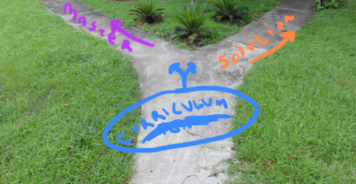

# Master-Solution Branch Splitter



## Prerequisites
* A repository with a branch called `curriculum-team` containing a jupyter-notebook `index.ipynb` file
* Code cells containing solution-only code should be "tagged" as such. To do this add the following comment anywhere in the the cell:
```
# __SOLUTION__
```

## Outputs
* A `master` branch that includes a `index.ipynb` notebook file and `README.md` markdown file. The `master` branch will have all markdown cells + all _untagged_ code cells

* A `solution` branch that includes a `index.ipynb` notebook file and `README.md` markdown file. The `solution` branch will have all markdown cells + all `# __SOLUTION__` tagged code cells. (the `__SOLUTION__` tag is removed for the `solution` branch. Students will not see internal tooling.)

## INSTRUCTIONS

From the target repository run `python <path-to-index.py file>`.

### TODO
* Create alias and add instructions like Markdown Merger
* get commit message from curriculum-team branch and add as commit to master & sol
* more thought into how it would handle cell types other than markdown or code (master is probs fine, what about solution??)
* are the remote/local branches tracking / do we need to -u to set upstream ????
* what if master is protected? do we need to -f force push? seemed to work
